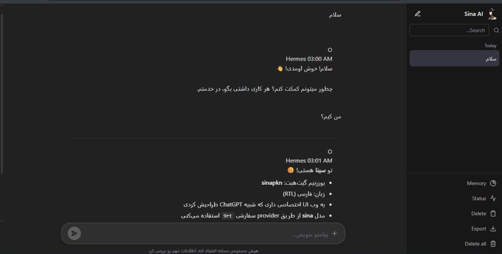

# Hermes Web UI

A ChatGPT-style web interface for [Hermes Agent](https://hermes-agent.nousresearch.com).
Works with or without Hermes — falls back to direct API chat when Hermes CLI isn't installed.

**📘 [نسخه فارسی](README-fa.md)**

---

## Preview



---

## One-Click Install

```bash
git clone https://github.com/sinapkn/hermes-web-ui.git
cd hermes-web-ui
bash install.sh
```

The installer auto-detects your setup:
- **With Hermes CLI** → Full agent (terminal, file ops, web search)
- **Without Hermes** → Local chat mode (direct API, just conversation)

---

## Auto-Detection

| Feature | With Hermes | Without Hermes |
|---------|-------------|----------------|
| Model & provider | Auto from config | Ask during install |
| Terminal/file tools | Yes | No |
| Web search | Yes | No |
| Sessions | state.db | In-memory |
| API mode | CLI backend | Direct HTTP |

---

## Expose Publicly

1. Go to [railway.app](https://railway.app) → New Project
2. Add a TCP Proxy service
3. Run: `bash install.sh 3000 "http://your-proxy:port"`

---

## Features

- **Word-by-word typing** — like ChatGPT
- **File upload** — images, docs, code with preview
- **Full agent tools** — terminal, file ops, web search (with Hermes)
- **Dark theme** — clean, modern UI
- **RTL Persian** — full Farsi support
- **Session persistence** — powered by Hermes state.db
- **Mobile PWA** — installable on phones
- **Upload menu** — image, doc, code, any file
- **Drag & drop** — drop files anywhere

---

## Tech Stack

- **Backend:** Node.js + Express + Multer
- **Frontend:** Vanilla JS (no framework)
- **AI:** Hermes CLI or Direct LLM API
- **Process:** PM2
- **Database:** Hermes state.db (SQLite)

---

## Configuration

### With Hermes CLI
Reads from `~/.hermes/.env` automatically.

### Without Hermes (Local Mode)
The installer will ask for:
- Model name (e.g., `gpt-4o`, `claude-sonnet-4`)
- API Base URL (e.g., `https://api.openai.com/v1`)
- API Key

---

## License

MIT

---

Made with by [SINA pk](https://github.com/sinapkn)
